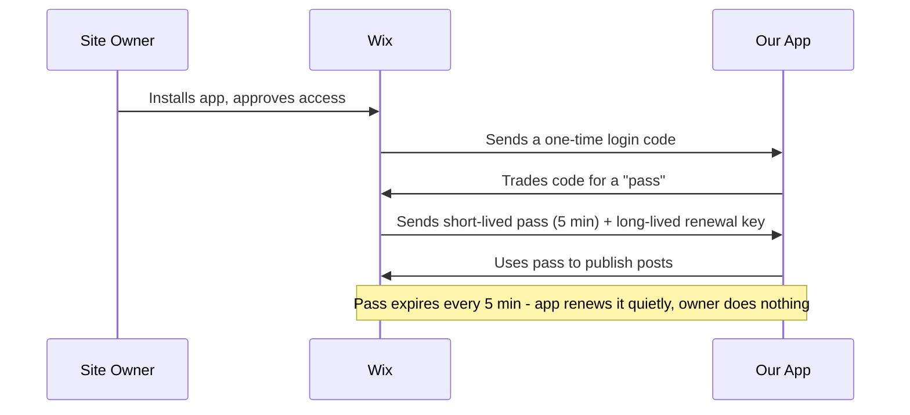
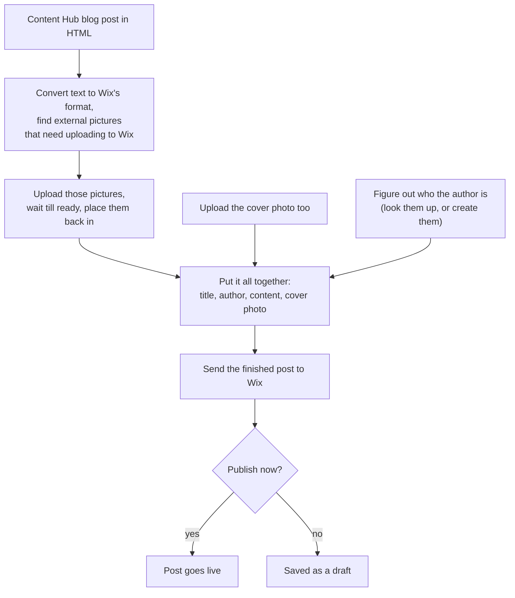

# Publishing Blog Posts to a User's Wix Site — OAuth, Permissions & Publish Flow

**Goal:** How our integration authenticates with Wix, what permissions it needs to publish a blog post (with images) to a user's own Wix site, and how a raw HTML draft turns into a live post.

---

## 1. OAuth Flow (Wix Apps)

We need to use a registered **Wix App** using OAuth **Authorization Code flow** — the privileged flow that grants write access to a specific site's Blog/Media/Members data (not the unauthenticated "headless" visitor-token flow, which is read/buy-only).



- **Access token lifetime:** `expires_in` ~**300 seconds (5 min)**. Refresh via `refresh_token` — long-lived until the user uninstalls/revokes, no re-consent needed.
- **⚠️ Not included:** the token proves *the site* authorized us, not *which member* to credit as author. Author is a separate required resolution step — see Section 3, step 5. Skipping it is what produces `"Missing post owner information"`.

**Read more:** [Create Access Token (OAuth2)](https://dev.wix.com/docs/api-reference/app-management/oauth-2/create-access-token)

---

## 2. Permissions Needed to Publish a Blog Post (Ricos + Image Upload)

Publishing a post with embedded/cover images touches three separate Wix products, so the app's permission set (requested at registration, approved at install) must cover all three:

| Permission (Wix Developers Center → Permissions) | Why we need it | API it unlocks |
|---|---|---|
| **Blog — manage blog posts** | Create the draft and publish it | Blog Draft Posts API (`/blog/v3/draft-posts`) |
| **Media Manager — add & manage media** | Upload/import cover image and every image referenced inside the post body | Media Import/Upload API (`/site-media/v1/files/*`) |
| **Members — manage members** | Resolve (or create) the `memberId` that becomes the post's author — required on every `draftPost` when calling as a third-party app | Members API (`/members/v1/members`) |
| **Rich Content (Ricos) — convert & validate documents** | Turn the user's raw HTML into the Ricos JSON the Blog API requires, before the Blog/Media/Members calls even run | Ricos Documents API (`/ricos/v1/ricos-document/convert/to-ricos`, `/validate`) |

**Read more:** [Create Draft Post](https://dev.wix.com/docs/api-reference/business-solutions/blog/draft-posts/create-draft-post) · [Import File (Media Manager)](https://dev.wix.com/docs/api-reference/assets/media/media-manager/files/import-file) · [List Members](https://dev.wix.com/docs/api-reference/crm/members-contacts/members/member-management/members/list-members) · [Create Member](https://dev.wix.com/docs/api-reference/crm/members-contacts/members/member-management/members/create-member) · [Convert To Ricos Document](https://dev.wix.com/docs/api-reference/assets/rich-content/ricos-documents/convert-to-ricos-document) · [Validate Document](https://dev.wix.com/docs/api-reference/assets/rich-content/ricos-documents/validate-document)

---

## 3. Publish Flow — From Raw HTML to a Live Post

Users write in HTML/rich text; Wix's Blog API does not accept HTML — it requires **Ricos**, Wix's structured JSON rich-content format. The flow below is what happens between "user hits Publish" and "post is live."



### Step-by-step

1. **Raw HTML in.** The user's draft (rich text or pasted HTML) contains text formatting, `` tags, and separately a cover image (url or uploaded file).
2. **Convert HTML to Ricos before touching Media Manager.** `POST /ricos-document/convert/to-ricos` with the raw `html` and an `options.plugins` list (see [Plugins](#plugins-option-what-it-actually-does) below). `` tags become `IMAGE` nodes that still reference the original external `src` — nothing has been uploaded yet. Doing this first, rather than pre-scanning the raw HTML for `` tags, guarantees the image list matches exactly what the converter actually kept (recall not every tag survives — see the Plugins section).
3. **Import every image the converted tree still references externally.** Walk the Ricos nodes for `IMAGE` src urls with no Media Manager `id` yet, and import each once (dedupe by url — a repeated image shouldn't upload twice). Two source cases: a **remote url** goes straight to `POST /site-media/v1/files/import`; a **local file** needs `generate-upload-url` first, then a `PUT` of the raw bytes to the returned upload url. Either way, poll `get-file-by-id` with bounded retries until real dimensions are available — a Ricos `IMAGE` node requires `width`/`height`, so don't hand it a `{0,0}` placeholder. Treat one image's `FAILED` status or a polling timeout as an isolated failure (leave that node pointing at the external url, or drop it with a logged warning) rather than aborting the whole publish over one bad image.
4. **Splice results back into the tree.** Each matched `IMAGE` node's `src` becomes `{ id }`, plus the `width`/`height` (and `altText`, if available) Wix now requires on that node.
5. **Resolve the author.** The Blog API requires `memberId` on every `draftPost` created by a third-party app — there's no "current user" concept from an app token. List members and pick one (e.g. a configured default, or the one tied to the install), and only fall back to creating a new member if none exists yet. Do this resolution once per site/install and cache it — it's the same author for every post from that connection, not a per-publish lookup.
6. **Cover image is not a Ricos node — handle it independently.** It goes through the same import path as body images, but its resulting file id lands on `draftPost.heroImage`, not spliced into `richContent`. Because it's the most visible image on the post, prefer failing the whole publish over silently shipping without a cover, unlike the best-effort handling for inline images in step 3.
7. **Assemble and send.** Combine `title`, `memberId`, `richContent`, `heroImage`, and any SEO fields into the `draftPost` body and `POST /blog/v3/draft-posts`. Whether to pass `publish: true` in that same call versus creating as draft then issuing a separate publish call is an implementation choice — either is a valid Blog API usage; the important part is the image and author resolution above must complete *before* this call, since the request is rejected if `richContent` still contains unresolved `id`-less image nodes.
8. **Result.** Wix returns the post's id and, if requested via `fieldsets: ['URL']`, its live URL, to hand back to the caller.

### Plugins option: what it actually does

`convert/to-ricos` doesn't convert HTML wholesale — it only converts the tags covered by the plugin names listed in `options.plugins`. Anything else is either flattened to plain text or **silently dropped**.

**Recommended plugin list for a blog editor:** `HEADING`, `LINK`, `IMAGE`, `GALLERY`, `VIDEO`, `TABLE`, `DIVIDER`, `CODE_BLOCK`, `COLLAPSIBLE_LIST`, `TEXT_COLOR`, `TEXT_HIGHLIGHT`, `ACTION_BUTTON`.

```json
{
  "html": "<h1>Welcome</h1><p>Read our <a href=\"https://example.com\">docs</a></p>",
  "options": {
    "plugins": ["IMAGE", "LINK", "HEADING"]
  }
}
```

| Plugin | Without it | With it |
|---|---|---|
| `HEADING` | `<h1>`–`<h6>` collapse into a plain `PARAGRAPH` (formatting/level lost) | Becomes a Ricos `HEADING` node with the correct `level` |
| `LINK` | `<a>` text keeps its wording but the hyperlink is dropped | Becomes a `TEXT` node with a `LINK` decoration (clickable) |
| `IMAGE` | `` tags are **silently dropped** — no error, no placeholder, the image just isn't in the output | Becomes an `IMAGE` node (still referencing the original external `src`, which step 4 then swaps for the Media Manager id) |

Practical implication for product: our plugin list must be a superset of every tag type we intend to support in the HTML editor. If the editor later adds tables or code blocks but we forget to add `TABLE` / `CODE_BLOCK` to this list, those blocks vanish from the published post with no error surfaced anywhere — this is a checklist item for every editor feature addition, not a one-time setup task. (Other available plugins: `AUDIO`, `VIDEO`, `GALLERY`, `TABLE`, `CODE_BLOCK`, `COLLAPSIBLE_LIST`, `DIVIDER`, `TEXT_COLOR`, `TEXT_HIGHLIGHT`, `ACTION_BUTTON`, and more — capped at 100 plugins per request.)

### Limitations: converted output is not a pixel-perfect copy of the input HTML

`convert/to-ricos` is a **best-effort normalization**, not a lossless transform. Expect differences between the original HTML and the published post:

- **Only listed-plugin tags survive.** Anything outside the plugin list is flattened to plain text or dropped entirely (images especially — see table above).
- **Custom styling doesn't carry over.** Inline CSS, custom classes, custom fonts, exact spacing/margins, and non-standard layout markup (arbitrary nested `<div>`s, flexbox/grid layouts) have no Ricos equivalent — Ricos has a fixed set of native block types, not an arbitrary style system.
- **Structure gets normalized to the nearest supported block.** E.g. a styled `<div>` used as a visual callout box will likely become a plain `PARAGRAPH`, since there's no "styled div" node in Ricos.

**Why this trade-off is intentional, not a bug:** Ricos is the same structured format the Wix Blog/Site Editor itself edits in. Because the published post is stored as Ricos nodes (not as opaque raw HTML), the site owner can reopen it in the Wix Editor and edit it like any native Wix blog post — move blocks, restyle text, drag in new images — the same way they'd edit a post they wrote by hand in Wix. An exact HTML→pixel copy would only be achievable by embedding the raw markup in an `HTML` embed block, which Wix's editor treats as an opaque iframe, not editable native content — and it's worse for SEO too: content inside an iframe embed isn't crawlable/indexable as page content the way native Ricos text nodes are, so an "exact copy" post would likely rank worse than the normalized one. We're trading input fidelity for output editability and SEO, and that's the correct trade for "publish to the user's own site," not a shortcut we should try to eliminate.

### Failure points worth flagging to product

- Image import can fail (`operationStatus: FAILED`) if the source host blocks hotlinking — we should decide the UX for "post published, one image missing" rather than blocking the whole publish.
- An HTML tag type missing from `options.plugins` fails the same way as a hotlink-blocked image: no error, content silently absent from the published post.

**Read more:** [Ricos Documents API — Introduction](https://dev.wix.com/docs/api-reference/assets/rich-content/ricos-documents/introduction) · [Rich Content overview](https://dev.wix.com/docs/api-reference/articles/work-with-wix-apis/platform/about-rich-content) · [Ricos document structure](https://dev.wix.com/docs/ricos/getting-started/introduction)
